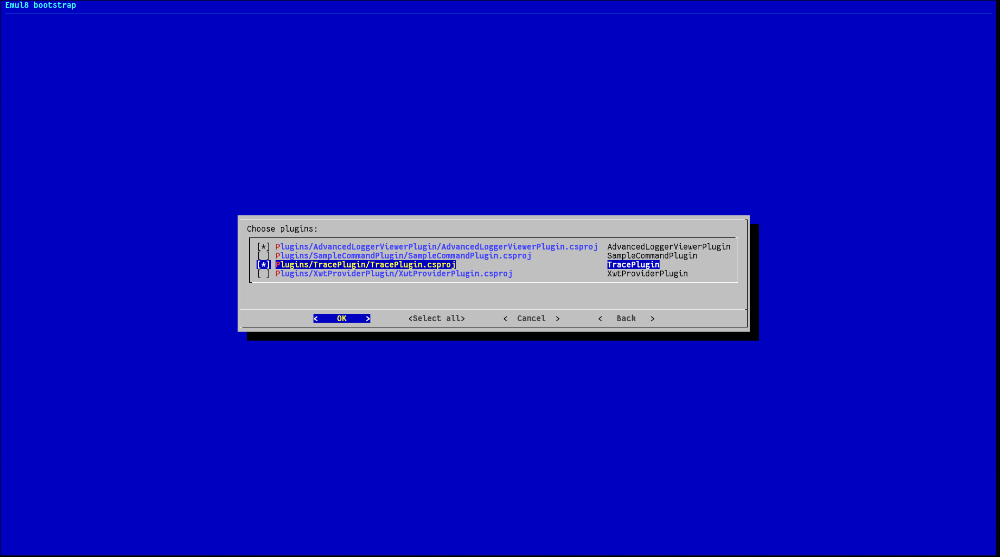

.. _build-procedure:

Build procedure
===============

This chapter describes the build procedure of the Emul8 framework.
It assumes that you have all the necessary requirements, as described in :doc:`system_requirements`.

In :ref:`build-basic` we describe the basic options, which are enough for everyday use.

If you want to understand the build procedure in more detail or customize it, see :ref:`build-details` further down.

.. _build-basic:

Building Emul8
--------------

The build process consists of two phases.

.. rubric:: bootstrap.sh

First, you have to create a solution file, that will later be compiled.
This is done by running :program:`boostrap.sh`, which allows to choose interactively which parts of the Emul8 framework get compiled.

The script supports the following options:

.. program:: bootstrap.sh

.. option:: -a

    Batch mode, generates the ``All projects`` solution without interaction with the user.

.. option:: -d value

    Location of base directories (';'-separated).

.. option:: -b value

    Location for binaries compiled from generated project.

.. option:: -o value

    Location of generated files.

.. option:: -h

    Prints help information.

.. rubric:: build.sh

The second step is to run :program:`build.sh`, which supports the following options:

.. program:: build.sh

.. option:: -v

   Verbose mode (more build debug output, but slower build).

.. option:: -d

   Build all projects in Debug mode (more runtime debug information, but slower execution).

.. option:: -c

   Clean all directories including the translation libs so that Emul8 can be fully rebuilt (might take a bit longer).

.. option:: -i

   Install an ``emul8`` script in the */usr/bin* directory which lets you run Emul8 from anywhere in the system.

.. note::

   If you are working on a git repository, remember to rebuild after each ``git pull`` command.

.. _build-details:

Detailed building information
-----------------------------

Cores
+++++

Unlike the rest of the project, CPU core libraries are written in the *C* language.
It is required to use a special plugin in order to compile it with the *xbuild* framework.
`CCTask <http://github.com/antmicro/cctask>`_ is used for this purpose.

The CPU core libraries are compiled automatically by the ``bootstrap.sh`` script.

Every core architecture listed below has its own project file located in the ``Emulator/Cores`` directory:

* arm,
* arm-m,
* i386,
* ppc,
* sparc.

Each project file defines **endianness** supported by a translation library and the target's **architecture**.
Additionally it contains a group of properties required by *Monodevelop* in order to display the project properly in the solution tree.

.. note::

   Due to limitations of *Monodevelop*, core libraries projects have the *.csproj* extension (instead of the standard *.cproj*).

.. note::

   Due to bugs in *xbuild*, projects must provide a redundant ``EmulatedTarget`` property that has in most cases the same value as ``Architecture``.
   Although this bug is already fixed in mainline *xbuild*, this workaround is still here so we don't require the newest *mono* to build Emul8.

.. note::

   Although *CCTask* allows to build projects in parallel (the default setting), it sometimes fails due to bugs in *mono*.
   As a result, it is now disabled.

The targets for building and cleaning the project are defined in the common project file *cores.template.csproj*.
The build action consists of building the *translate.cproj* file for selected endianness and putting the output libraries into a single *zip* archive.

Host architecture detection
+++++++++++++++++++++++++++

The build scripts detect the word size of the host machine automatically using ``EnvironmentTask`` provided by *CCTask*.
The host architecture (and endianness) are hardcoded to **i386** and **little endian**, as *Emul8* can be run only on a PC right now.

Bootstrapping
+++++++++++++

Bootstrapping is a process of creating a dynamic solution file tailored to the needs of a developer.
Instead of using the *AllProjects* solution containing references to every project in the *Emul8* folder (and causing all this projects to be built) you can choose which elements are really needed in a given configuration.

*Bootstrap* is a command-line tool that automatically searches for projects and lets you decide which to include to generate a solution file.

Most users will be able to run :program:`/bootstrap.sh` which provides capabilities necessary to prepare the build process before running :program:`./build.sh`.
This section however focuses on *Bootstrap* in more detail, since this is a standalone program which can be used for more advanced use cases.

To run *Bootstrap* in interactive mode just execute ``Bootstrap.exe --interactive``.
This will start a dialog-like UI and scan the current folder for ``*.csproj`` files recursively.

*Bootstrap* will resolve all referenced projects and generate the output to *Emul8.sln*.

It also is possible to run *Bootstrap* in batch mode, which can be used in non-interactive scripts.
The main actions available in batch mode are as follows:

.. glossary::

    **Scan**
        To scan the selected folder for projects of a given type execute::

           Bootstrap.exe scan --type Plugin --directories /path/to/folder;/path/to/another/folder

        Available project types are: **UI**, **Extension**, **Plugin**, **Tests**, **CpuCore** or **Unknown**.

        The project type is determined by reading the value of the *ProjectInfo* property.
        If the property is not set, **Unknown** is assumed.

    **GenerateSolution**
        To generate a solution file execute::

           Bootstrap.exe GenerateSolution --output /path/to/output/solution --main-project /path/to/main/project.csproj --additional-projects /path/to/project_one.csproj;/path/to/project_two.csproj

    **Clean**
        This option is used to clean all files generated by bootstrap, i.e.: solution file and build-hooks files.

    **GenerateAll**
        This option allows to generate a solution of all projects with references using a single command::

           Bootstrap.exe GenerateAll

Again, for the most common use cases you can just use :program:`bootstrap.sh` - it makes sure that both *Bootstrap* and *CCTask* projects are properly built and runs *Bootstrap* in interactive mode.
